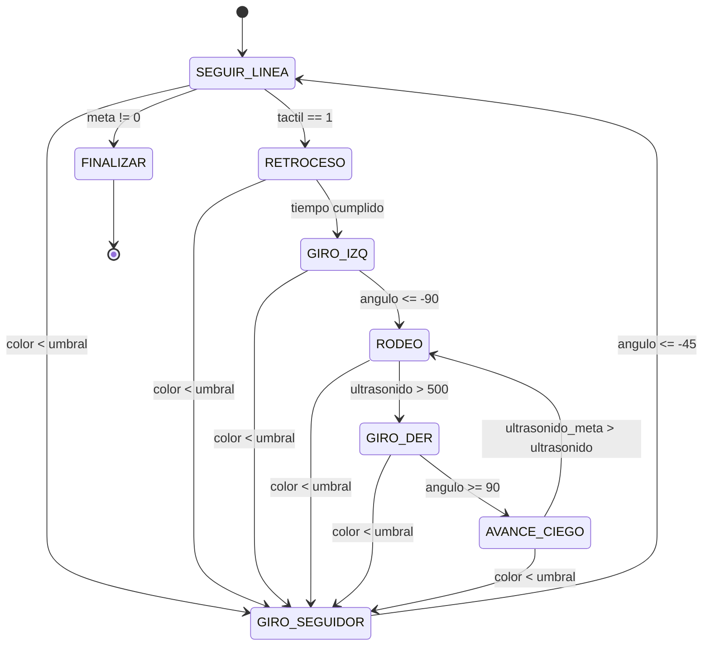

# Máquina de Estados — Bug2

## Transiciones

| Estado actual | Condición | Estado siguiente |
|---|---|---|
| `SEGUIR_LINEA` (0) | `meta != 0` | `FINALIZAR` (5) |
| `SEGUIR_LINEA` (0) | `tactil == 1` | `RETROCESO` (6) |
| `SEGUIR_LINEA` (0) | `color < umbral` | `GIRO_SEGUIDOR` (7) |
| `RETROCESO` (6) | `tiempo cumplido` | `GIRO_IZQ` (2) |
| `RETROCESO` (6) | `color < umbral` | `GIRO_SEGUIDOR` (7) |
| `GIRO_IZQ` (2) | `angulo <= -90` | `RODEO` (1) |
| `GIRO_IZQ` (2) | `color < umbral` | `GIRO_SEGUIDOR` (7) |
| `RODEO` (1) | `ultrasonido > 500` | `GIRO_DER` (3) |
| `RODEO` (1) | `color < umbral` | `GIRO_SEGUIDOR` (7) |
| `GIRO_DER` (3) | `angulo >= 90` | `AVANCE_CIEGO` (4) |
| `GIRO_DER` (3) | `color < umbral` | `GIRO_SEGUIDOR` (7) |
| `AVANCE_CIEGO` (4) | `ultrasonido_meta > ultrasonido` | `RODEO` (1) |
| `AVANCE_CIEGO` (4) | `color < umbral` | `GIRO_SEGUIDOR` (7) |
| `GIRO_SEGUIDOR` (7) | `angulo <= -45` | `SEGUIR_LINEA` (0) |

> **Nota**: La transición `color < umbral → GIRO_SEGUIDOR` desde cualquier estado (excepto `SEGUIR_LINEA`, `GIRO_SEGUIDOR` y `FINALIZAR`) se evalúa como chequeo global en `main.py` antes del dispatch de estado.
