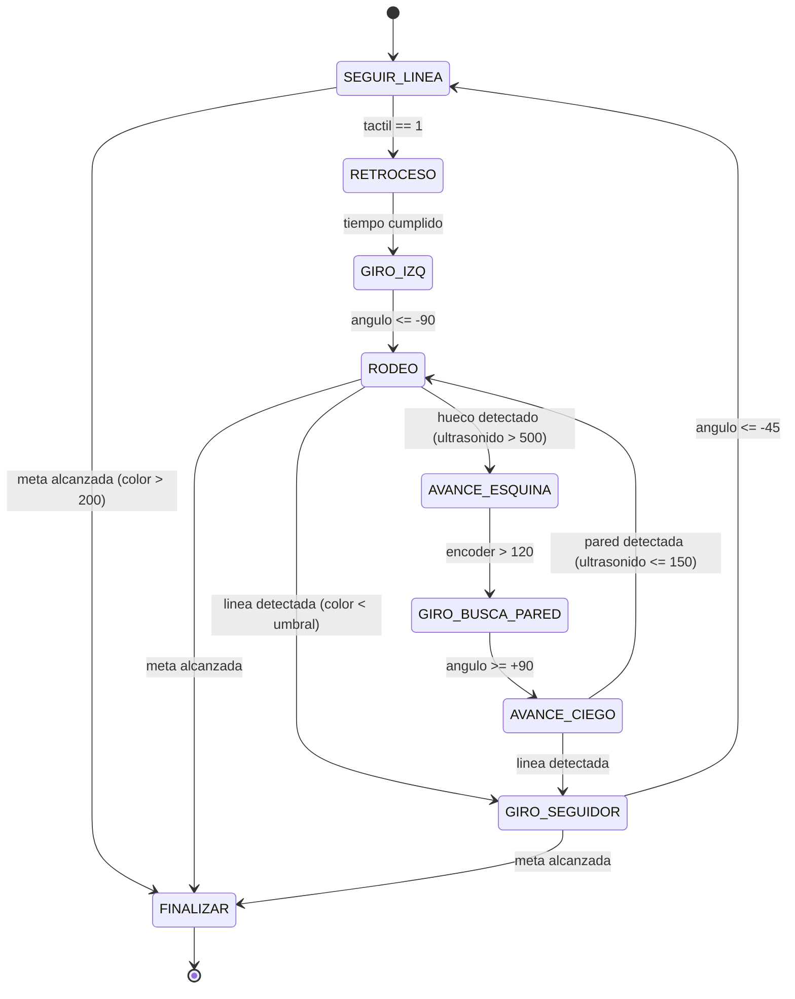
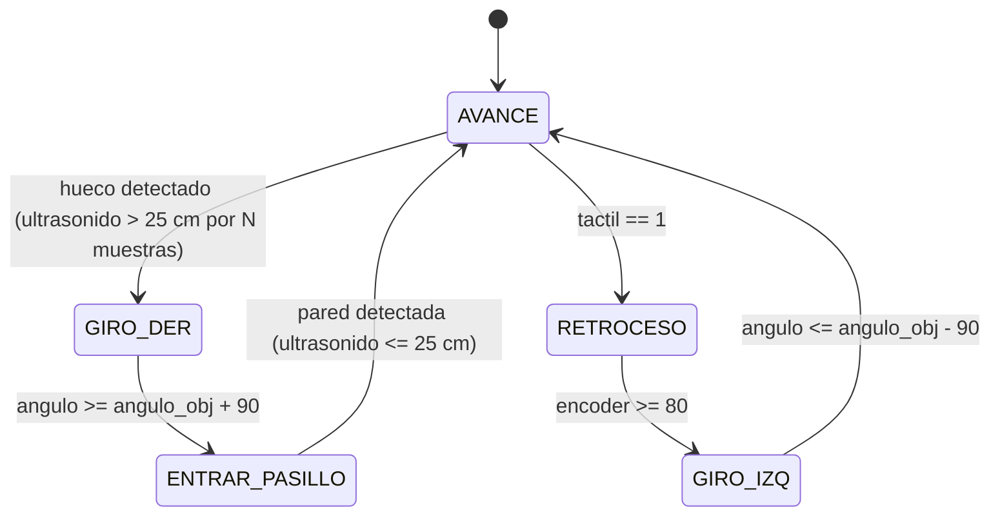

# Laboratorio 5 — Navegación basada en comportamientos con Robot EV3

## 1. Marco Teórico

### 1.1. Características de los tipos de navegación

#### Navegación planeada (deliberativa)

1. **Requiere un modelo interno del entorno:** El robot construye o utiliza un mapa previo del ambiente para planificar su trayectoria. Algoritmos como A* o Dijkstra calculan la ruta óptima entre origen y destino. Esto implica que cualquier cambio no previsto en el entorno invalida la ruta calculada, a menos que se replanifique (por ejemplo, mediante SLAM).
   
2. **Tiempo de procesamiento significativo:** La planificación requiere un ciclo de computación antes del movimiento. El robot primero "piensa" la ruta y luego la ejecuta. Esto introduce latencia y hace que el robot sea vulnerable ante cambios dinámicos que ocurran durante la ejecución.

#### Navegación basada en comportamientos (reativa)

1. **Descomposición en comportamientos simples:** Una tarea compleja se divide en módulos elementales (seguir línea, retroceder, girar, rodear obstáculo). Cada comportamiento se activa por condiciones sensoriales en tiempo real, sin necesidad de un mapa completo. Esto permite respuestas instantáneas ante obstáculos móviles o imprevistos.
   
2. **No requiere mapeo explícito del entorno:** El robot navega usando únicamente sus sensores locales (ultrasonido, tactil, color, giroscopio). No necesita conocer su posición absoluta en un mapa; solo necesita saber la relación entre su estado actual, sus lecturas sensoriales y la meta inmediata. Esto lo hace más robusto en entornos cambiantes pero menos eficiente en rutas largas.

### 1.2. Investigaciones destacadas

#### Rodney Brooks

Rodney Brooks es uno de los pioneros más influyentes de la robótica basada en comportamientos. Desde su posición en el MIT Artificial Intelligence Laboratory (y más tarde como director del MIT Media Lab), desarrolló el paradigma de **Subsumption Architecture** (arquitectura de subsumción) en 1986. Esta arquitectura organiza los comportamientos del robot en capas jerárquicas donde los comportamientos de nivel bajo (como evitar obstáculos) pueden "subsumir" o sobreescribir los de nivel alto (como planificar una ruta). Su filosofía se resumía en el lema *"The world is its own best model"* — el robot no necesita un mapa complejo si sus sensores le dan información suficiente para reaccionar. Bajo esta filosofía desarrolló robots como el **Genghis** (un robot hexápodo insectoide) y los robots de limpieza industrial de la empresa iRobot (creadora del Roomba), demostrando que comportamientos simples bien organizados producen comportamientos inteligentes complejos.

#### Mark Tilden

Mark Tilden es conocido por su enfoque en **BEAM robotics** (Biology, Electronics, Aesthetics, and Mechanics), una filosofía de robótica que busca crear robots con comportamientos complejos usando circuitos electrónicos simples en lugar de microcontroladores programables. Tilden desarrolló robots como los **Bicore** y **Nervous Network** robots, que utilizaban redes de transistores y pocos componentes para generar comportamientos emergentes como seguimiento de luz, evitación de obstáculos y exploración. Sus trabajos más conocidos incluyen los robots de la línea **WowWee** (como el Robosapien y los BiAlife), que llevaron la robótica de comportamiento al mercado masivo. La filosofía de Tilden se centra en que un robot no necesita ser "inteligente" en el sentido computacional; con los circuitos adecuados y un diseño bioinspirado, puede exhibir comportamientos sorprendentemente complejos y adaptativos.

### 1.3. Algoritmos de planificación de rutas para espacios con obstáculos

1. **Algoritmos Bug (Bug0, Bug1, Bug2):** Algoritmos de navegación reactivos que combinan avance directo hacia la meta con maniobras de rodeo cuando se encuentra un obstáculo. Son los más utilizados en robótica básica y son los implementados en este laboratorio.
2. **Potential Fields (Campos de Potencial):** El robot es atraído por un potencial negativo en la meta y repelido por potenciales positivos en los obstáculos. La fuerza resultante determina la dirección de movimiento. Es eficiente pero puede quedar atrapado en mínimos locales.
3. **RRT (Rapidly-exploring Random Trees):** Algoritmo de planificación que construye aleatoriamente un árbol de trayectorias posibles desde el origen hasta la meta, expandiéndose de forma que explore rápidamente el espacio de configuración. Es muy usado en navegación 3D y robots con muchas dimensiones.

### 1.4. Descripción de algoritmos Bug

#### Bug 0
Es la versión más simple de la familia Bug. El robot avanza en línea recta hacia la meta. Cuando detecta un obstáculo, comienza a rodearlo manteniendo contacto con la pared (wall-following) hasta que la línea recta hacia la meta está libre de obstáculos, momento en el que retoma el avance directo. No tiene memoria de la geometría del obstáculo y puede recorrer tramos innecesarios del perímetro.

#### Bug 1
Similar a Bug 0, pero incorpora una etapa de "búsqueda de punto de leaving". Al encontrar un obstáculo, el robot registra el punto donde lo tocó (hit point) y comienza a rodearlo. Mientras rodea, calcula en cada instante la distancia recta a la meta. Cuando el robot alcanza un punto del perímetro que está más cerca de la meta que el hit point, y la línea recta al meta está libre, abandona el obstáculo. Esto garantiza que no recorra más perímetro del necesario.

#### Bug 2 (implementado en este laboratorio)
Define una **línea m** (m-line) como la línea recta que conecta el punto de inicio con la meta. El robot avanza siguiendo esta línea. Al encontrar un obstáculo, comienza a rodearlo siguiendo la pared (wall-following). El robot abandona el perímetro del obstáculo solo cuando vuelve a cruzar la m-line en un punto que está más cerca de la meta que el punto de entrada al rodeo. Esto garantiza progreso monotónico hacia la meta. Es más eficiente que Bug 1 porque solo permite una entrada por obstáculo a la m-line.

### 1.5. Algoritmo de resolución de laberintos: Wall-Following (Seguimiento de pared derecha)

El algoritmo **Wall-Following** (seguimiento de pared) es uno de los más utilizados para resolver laberintos. La regla es simple: el robot siempre mantiene la pared derecha (o izquierda) en contacto con su sensor lateral. Si la pared derecha está presente, avanza recto. Si la pared derecha desaparece, gira a la derecha. Si hay una pared frontal, gira a la izquierda. Esta estrategia garantiza la resolución de cualquier laberinto que sea simplemente conexo (sin islas). En este laboratorio se implementó una variante adaptada: el robot avanza en un pasillo usando un control proporcional basado en el giroscopio, detecta intersecciones (huecos donde la pared derecha desaparece) mediante un sensor de ultrasonido, y elige girar a la derecha al encontrar cada bifurcación, aplicando retroceso y giro cuando choca frontalmente.

---

## 2. Implementación: Misión 1 — Evitar Obstáculos (Algoritmo Bug2)

### 2.1. Descripción de la solución

La solución implementa el algoritmo **Bug2** para navegar desde P1 hasta P2 evitando dos obstáculos. El robot utiliza un **seguidor de línea negra** como proxy de la m-line (la línea recta entre origen y meta). Esta decisión combina la navegación reactiva del Bug2 con la robustez del seguidor de línea, eliminando la necesidad de odometría absoluta para conocer la posición respecto a la m-line.

El robot avanza siguiendo la línea negra. Al chocar contra un obstáculo (sensor táctil), retrocede, gira 90° a la izquierda y comienza el **rodeo** (wall-following), manteniendo una distancia lateral constante al obstáculo mediante un sensor de ultrasonido y un controlador proporcional. Cuando detecta un hueco a la derecha (ultrasonido > 500 mm), gira a la derecha 90° y avanza ciego hasta encontrar la línea negra nuevamente, momento en el que retoma el seguidor de línea.

### 2.2. Arquitectura del código

El código se organiza en dos archivos principales:

- **`Estados.py`**: Define la clase `Robot` (base) con atributos de sensores y actuadores, y la clase `bug_2` (heredada) con la implementación del algoritmo como una máquina de estados finitos.
- **`main.py`**: Bucle principal que lee sensores del EV3 (color, táctil, ultrasonido, giroscopio), invoca la máquina de estados y envía las órdenes a los motores.

### 2.3. Máquina de estados — Bug2 (Evitar Obstáculos)

```
ESTADOS:
  0: SEGUIR_LINEA    — Sigue la línea negra con corrección proporcional
  1: RODEO            — Wall-following manteniendo distancia al obstáculo
  2: GIRO_IZQ         — Gira 90° a la izquierda (retroceso post-colisión)
  3: GIRO_DER         — Gira 90° a la derecha (salto al otro lado del obstáculo)
  4: AVANCE_CIEGO     — Avanza recto buscando la línea o nueva pared
  5: FINALIZAR        — Meta alcanzada (detiene motores)
  6: RETROCESO        — Retrocede durante un tiempo fijo tras colisión
  7: GIRO_SEGUIDOR    — Gira a la izquierda buscando reencontrar la línea
```



#### Transiciones detalladas

| Estado actual | Condición | Estado siguiente |
|---|---|---|
| `SEGUIR_LINEA` (0) | `color > 200` (meta) | `FINALIZAR` (5) |
| `SEGUIR_LINEA` (0) | `tactil == 1` (choque) | `RETROCESO` (6) |
| `RETROCESO` (6) | `tiempo > 1.2s` | `GIRO_IZQ` (2) |
| `GIRO_IZQ` (2) | `angulo <= -90` | `RODEO` (1) |
| `RODEO` (1) | `color > 200` (meta) | `FINALIZAR` (5) |
| `RODEO` (1) | `color < umbral` (línea) | `GIRO_SEGUIDOR` (7) |
| `RODEO` (1) | `ultrasonido > 500` (hueco) | `AVANCE_ESQUINA` (8) |
| `AVANCE_ESQUINA` (8) | `encoder > 120` | `GIRO_BUSCA_PARED` (9) |
| `GIRO_BUSCA_PARED` (9) | `angulo >= +90` | `AVANCE_CIEGO` (4) |
| `AVANCE_CIEGO` (4) | `color < umbral` (línea) | `GIRO_SEGUIDOR` (7) |
| `AVANCE_CIEGO` (4) | `ultrasonido <= 150` (pared) | `RODEO` (1) |
| `GIRO_SEGUIDOR` (7) | `color > 200` (meta) | `FINALIZAR` (5) |
| `GIRO_SEGUIDOR` (7) | `angulo <= -45` | `SEGUIR_LINEA` (0) |

### 2.4. Pseudocódigo

```
INICIALIZAR:
    estado = SEGUIR_LINEA
    angulo_objetivo = 0
    encoder_acumulado = 0

BUCLE PRINCIPAL:
    LEER sensores (color, tactil, ultrasonido, giroscopio)
    
    SEGUN estado HACER:
    
    CASO SEGUIR_LINEA:
        SI color < umbral ENTONCES
            izq = potencia + KP    // corrige hacia la izquierda
            der = potencia - KP
        SINO
            izq = potencia - KP    // corrige hacia la derecha
            der = potencia + KP
        FIN SI
        
        SI color > 200 ENTONCES -> FINALIZAR
        SI tactil == 1 ENTONCES -> RETROCESO
    
    CASO RETROCESO:
        izq = -potencia
        der = -potencia
        SI tiempo_transcurrido > 1.2s ENTONCES -> GIRO_IZQ
    
    CASO GIRO_IZQ:
        izq = -potencia
        der = +potencia
        SI angulo <= -90 ENTONCES
            angulo_objetivo -= 90
            -> RODEO
        FIN SI
    
    CASO RODEO:
        error = ultrasonido - 60    // error de distancia a pared
        Control proporcional de motores
        SI color > 200 ENTONCES -> FINALIZAR
        SI color < umbral ENTONCES -> GIRO_SEGUIDOR
        SI ultrasonido > 500 ENTONCES -> AVANCE_ESQUINA
    
    CASO AVANCE_ESQUINA:
        izq = potencia
        der = potencia
        SI encoder > 120 ENTONCES -> GIRO_BUSCA_PARED
    
    CASO GIRO_BUSCA_PARED:
        izq = potencia
        der = -potencia
        SI angulo >= angulo_objetivo + 90 ENTONCES
            angulo_objetivo += 90
            -> AVANCE_CIEGO
        FIN SI
    
    CASO AVANCE_CIEGO:
        izq = potencia
        der = potencia
        SI color < umbral ENTONCES -> GIRO_SEGUIDOR
        SI ultrasonido <= 150 ENTONCES -> RODEO
    
    CASO GIRO_SEGUIDOR:
        SI color > 200 ENTONCES -> FINALIZAR
        SI angulo <= -45 ENTONCES -> SEGUIR_LINEA
    
    CASO FINALIZAR:
        DETENER motores
        SALIR

    ENVIAR velocidades a motores
FIN BUCLE
```

### 2.5. Video de resultados
La implementación en laboratorio no se consiguio, lo mostrado en el video es la simulacion, se añade adicionalmente el archivo de simulación en coppeliasim (.ttt).

<a href="https://www.youtube.com/watch?v=3JEnnfGRU4A">

</a>
---

## 3. Implementación: Misión 2 — Superar el Laberinto

### 3.1. Descripción de la solución

La solución implementa una variante del algoritmo de **Wall-Following con prioridad derecha** para resolver un laberinto. El robot avanza dentro de los pasillos manteniendo una orientación recta mediante un controlador proporcional basado en el giroscopio. Utiliza un sensor de ultrasonido orientado hacia la pared derecha para detectar intersecciones (bifurcaciones o huecos) y un sensor táctil frontal para detectar paredes al final de los pasillos.

La estrategia consiste en:

1. **Avance en pasillo:** El robot avanza en línea recta usando el giroscopio como referencia de orientación (control P para mantener ángulo = 0).
2. **Detección de intersección:** Si el sensor de ultrasonido lee una distancia mayor al umbral (pared derecha desaparece) durante suficientes muestras consecutivas, el robot interpreta que hay una bifurcación a la derecha.
3. **Giro a la derecha:** El robot ejecuta un giro de 90° a la derecha, avanza para entrar al nuevo pasillo, y cuando detecta la pared a una distancia segura, reanuda el avance normal.
4. **Choque frontal:** Si el sensor táctil se activa (choca contra una pared al final del pasillo), el robot retrocede un tramo fijo y ejecuta un giro de 90° a la izquierda para tomar el pasillo opuesto.

### 3.2. Arquitectura del código

De manera análoga a la Misión 1, el código se divide en:

- **`Estados.py`**: Clase `laberinto` heredando de `Robot`, con los estados del laberinto.
- **`main.py`**: Bucle principal de lectura de sensores y envío a motores.

La diferencia principal respecto a la Misión 1 es que **no se utiliza sensor de color**. La navegación depende únicamente del ultrasonido (pared derecha), el táctil (pared frontal) y el giroscopio (orientación).

### 3.3. Máquina de estados — Laberinto

```
ESTADOS:
  0: AVANCE           — Avanza en el pasillo manteniendo orientación recta
  1: GIRO_DER         — Gira 90° a la derecha (intersección detectada)
  2: GIRO_IZQ         — Gira 90° a la izquierda (post-choque frontal)
  3: ENTRAR_PASILLO   — Avanza para entrar al nuevo pasillo tras giro
  4: RETROCESO        — Retrocede tras choque frontal
```




#### Transiciones detalladas

| Estado actual | Condición | Estado siguiente |
|---|---|---|
| `AVANCE` (0) | `ultrasonido > 25 cm` por `5000` muestras consecutivas | `GIRO_DER` (1) |
| `AVANCE` (0) | `tactil == 1` (choque frontal) | `RETROCESO` (4) |
| `GIRO_DER` (1) | `angulo >= angulo_objetivo + 90°` | `ENTRAR_PASILLO` (3) |
| `ENTRAR_PASILLO` (3) | `ultrasonido <= 25 cm` (pared detectada) | `AVANCE` (0) |
| `RETROCESO` (4) | `encoder >= 80` grados acumulados | `GIRO_IZQ` (2) |
| `GIRO_IZQ` (2) | `angulo <= angulo_objetivo - 90°` | `AVANCE` (0) |

### 3.4. Pseudocódigo

```
INICIALIZAR:
    estado = AVANCE
    angulo_objetivo = 0
    contador_hueco = 0
    MUESTRAS_HUECO = 5000
    PARED_CERCANA = 10 cm
    FACTOR_SEGURIDAD = 2.5

BUCLE PRINCIPAL:
    LEER sensores (tactil, ultrasonido, giroscopio, encoder)
    error = angulo_objetivo - angulo_actual   // para control proporcional

    SEGUN estado HACER:
    
    CASO AVANCE:
        Control proporcional para mantener angulo = angulo_objetivo
        
        SI ultrasonido > PARED_CERCANA * FACTOR_SEGURIDAD Y tiempo > 25s ENTONCES
            contador_hueco += 1
        SINO
            contador_hueco = 0
        FIN SI
        
        SI contador_hueco >= MUESTRAS_HUECO ENTONCES
            contador_hueco = 0
            -> GIRO_DER
        FIN SI
        
        SI tactil == 1 ENTONCES -> RETROCESO
    
    CASO GIRO_DER:
        izq = potencia
        der = -potencia
        SI angulo >= angulo_objetivo + 90 ENTONCES
            angulo_objetivo += 90
            -> ENTRAR_PASILLO
        FIN SI
    
    CASO ENTRAR_PASILLO:
        izq = potencia
        der = potencia
        SI ultrasonido <= PARED_CERCANA * FACTOR_SEGURIDAD ENTONCES
            -> AVANCE
        FIN SI
    
    CASO RETROCESO:
        Control proporcional inverso (retroceso)
        SI encoder >= 80 ENTONCES -> GIRO_IZQ
    
    CASO GIRO_IZQ:
        izq = -potencia
        der = +potencia
        SI angulo <= angulo_objetivo - 90 ENTONCES
            angulo_objetivo -= 90
            -> AVANCE
        FIN SI

    ENVIAR velocidades a motores
FIN BUCLE
```

### 3.5. Video de resultados

La implementación en laboratorio no se consiguio, lo mostrado en el video es la simulacion, se añade adicionalmente el archivo de simulación en coppeliasim (.ttt).

<a href="https://www.youtube.com/watch?v=rygYJ9ZeQQE">

</a>

---

## 4. Simulación de el Robot EV3

### 4.1. Entorno de simulación: CoppeliaSim

La simulación se realizo utilizando **CoppeliaSim**. La simulación permite validar la lógica de la máquina de estados, calibrar los parámetros del controlador y depurar transiciones de estado sin riesgo de dañar el hardware físico.

La conexión entre el código Python y CoppeliaSim se realiza a través de la **Remote API** de CoppeliaSim, que expone funciones para:

- **Lectura de sensores simulados:** `simxReadProximitySensor` para ultrasonido, `simxGetVisionSensorImage` para el sensor de color (con procesamiento de imagen a escala de grises), y orientación del cuerpo con `simxGetObjectOrientation`.
- **Control de actuadores:** `simxSetJointTargetVelocity` para establecer la velocidad de las ruedas.
- **Lectura de encoders:** `simxGetJointPosition` para obtener la posición angular de las ruedas.

La interfaz de sensores simulados se abstrae en funciones auxiliares (`leer_proximidad`, `leer_color`, `leer_gyro`) que retornan valores en las mismas unidades que el hardware real (centímetros, porcentaje de reflexión, grados).

### 4.2. Adaptación del código de simulación a código real

La transición de simulación a realidad requirió los siguientes cambios:

| Aspecto | Simulación (CoppeliaSim) | Realidad (EV3 + Pybricks) |
|---|---|---|
| **Plataforma** | Python 3 en PC, Remote API | MicroPython en EV3, Pybricks |
| **Conexión** | `sim.simxStart('127.0.0.1', 19997)` | Directo en el hub EV3 |
| **Sensores** | Funciones wrapper sobre Remote API | Clases `ColorSensor`, `UltrasonicSensor`, `TouchSensor`, `GyroSensor` de Pybricks |
| **Actuadores** | `simxSetJointTargetVelocity` | `Motor(Port.B).run(velocidad)` |
| **Encoder** | `simxGetJointPosition` | `Motor(Port.B).angle()` |
| **Giroscopio** | Extraído de orientación Euler con `simxGetObjectOrientation` y cálculo manual de delta acumulado | `GyroSensor(Port.S1).angle()` nativo |
| **Color** | Procesamiento de imagen RGB → escala de grises → normalización | `ColorSensor(Port.S4).reflection()` directo |
| **Táctil** | Simulado como distancia ultrasonido < 3 cm | `TouchSensor(Port.S2).pressed()` directo |
| **Potencia** | Velocidad normalizada (rad/s en simulación) | Velocidad en grados/s (100-120 en EV3) |
| **Bucle** | `while True` con polling libre | `while True` con polling libre (mismo patrón) |
| **Inicialización** | `sim.simxFinish` + `simxStart` | `EV3Brick()` + `ev3.speaker.beep()` |

### 4.3. Desafíos del paso a la realidad

1. **Calibración de sensores:** En la simulación, el sensor de color retorna valores predecibles (procesamiento de imagen controlado). En el EV3 real, la reflexión del sensor de color depende de la iluminación ambiental, la distancia al suelo y la calidad de la línea negra. Se calibró el umbral (`umbral = 17` para Esquivar, `umbral = 15` para Bug2) mediante pruebas empíricas.

2. **Giroscopio vs orientación Euler:** En simulación, el ángulo del robot se extrae de las coordenadas Euler de la orientación del cuerpo (`simxGetObjectOrientation`). En el EV3 real, el giroscopio nativo proporciona el ángulo directamente pero con **drift** (deriva) significativa a largo plazo. Para mitigar esto, se hace `reset_angle(0)` en ciertos cambios de estado relevantes. En general, se utilizan ángulos acumulativos y absolutos globales donde el "0°" es la orientación de la posición inicial del robot. Esto permite que el control de ángulo pueda ser bastante oscilante (Solo proporcional) evitando que el robot se mueva con orientaciones indeseadas después de realizar rotaciones de alta magnitud como lo son giros de ±90°. 

3. **Sensor táctil real vs simulado:** En la simulación, el táctil se simula verificando si la distancia ultrasonida es menor a 3 cm (no hay un sensor táctil real en el modelo). En el robot EV3, se usa un `TouchSensor` con valor binario directamente, este se encuentra conectado al puerto S2.

4. **Dinámica de los motores:** Los motores del EV3 tienen inercia, fricción y un torque máximo limitado. Parámetros que funcionaban en simulación (velocidades, tiempos de retroceso) tuvieron que ser ajustados para compensar la masa real del robot y la fricción del suelo.

5. **Encoder del motor:** El encoder del EV3 está integrado en el motor y retorna ángulos en una resolución específica. Se implementó una lógica de acumulación de deltas con corrección de saltos (> 180° o < -180°) tanto en simulación como en el código real, pero en el robot real los valores son más ruidos.

6. **Umbrales del ultrasonido:** La distancia de detección del obstáculo en rodeo se calibró a 60 mm en el código real (vs 12 cm en simulación) debido a la geometría del robot y los obstáculos físicos. El umbral de "hueco" para intersecciones se ajustó a 25 cm (pared derecha desaparece) con un contador de 5000 muestras para evitar falsos positivos por ruido.

7. **Lazo de control:** La dinámica del robot en simulación, no es la misma que en la realidad (los parámetros de tamaño, peso y fricción son diferentes en la realidad y en la simulación), por lo que los parámetros del controlador tuvieron que ser ajustados para el robot real.

### 4.4. Conexiones de hardware del EV3

```
Puerto B  → Motor izquierdo
Puerto C  → Motor derecho
Puerto S1 → GyroSensor (giroscopio)
Puerto S2 → TouchSensor (táctil frontal)
Puerto S3 → UltrasonicSensor (ultrasonido lateral/frontal)
Puerto S4 → ColorSensor (reflexión, orientado hacia abajo)
```

---

## 7. Referencias

**[1]** R. Siegwart, *Introduction to Autonomous Mobile Robots* (2nd ed.), The MIT Press, 2011, pp. 391 y siguientes.

**[2]** Wikipedia, "Behavior-based Robotics," [Online]. Available: [https://en.wikipedia.org/wiki/Behavior-based_robotics](https://en.wikipedia.org/wiki/Behavior-based_robotics).

**[3]** Tamie.org, "Behaviour Based Robotics & Deliberative Robotics," [Online]. Available: [https://web.archive.org/web/20100612151345/http://www.tamie.org/bbr.html](https://web.archive.org/web/20100612151345/http://www.tamie.org/bbr.html).

**[4]** P. Corke, *Robotics, Vision and Control: Fundamental Algorithms in MATLAB*, Springer-Verlag Berlin Heidelberg, 2011.

**[5]** K. Wolff, "Autonomous Agents course, Quarters III and IV, spring semester 2008," [Online]. Available: [https://www.am.chalmers.se/~wolff/AA/AutonomousAgents.html](https://www.am.chalmers.se/~wolff/AA/AutonomousAgents.html).

**[6]** F. Bullo and S. L. Smith, *Lectures on Robotic Planning and Kinematics Version v0.93*, [Online]. Available: [https://ucsb.app.box.com/v/LecturesRobotics](https://ucsb.app.box.com/v/LecturesRobotics).
